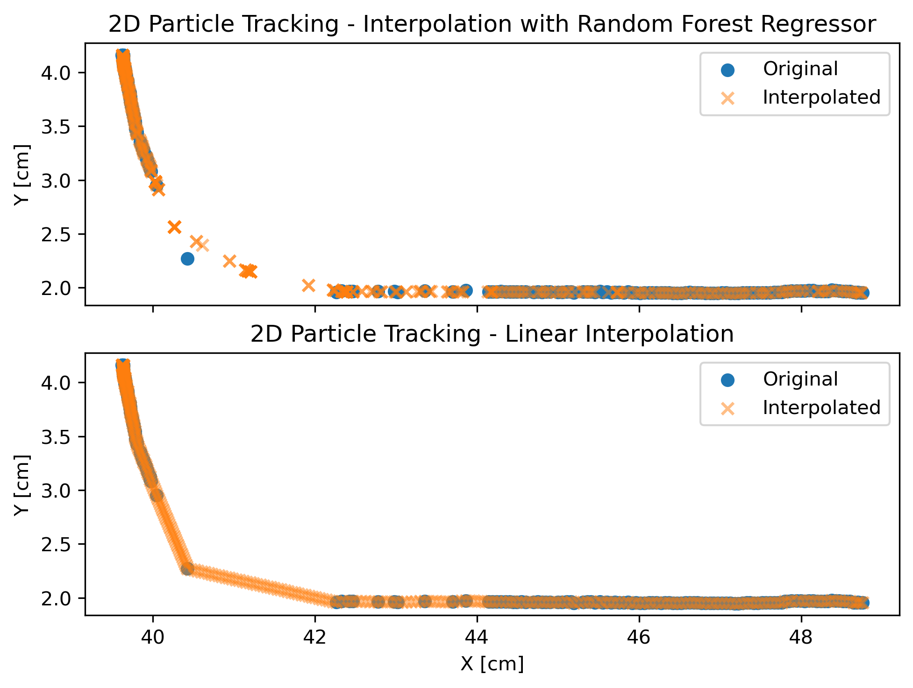

# Particle Position Interpolation - Random Forest vs Linear Interpolation
Missing data in particle tracking data is an important problem that is generally solved through predictive linking, which uses en ensemple of particle data to accurately guess missing positions of particles (see Trackpy v.0.5.0). Particles are lost for numerous reasons, due to phenomena such as lighting changes and image sensor issues.
This notebook endeavors to show two simple methods for interpolating this missing data in a single real particle track.

### Module Imports


```python
import pandas as pd
import numpy as np
from sklearn.ensemble import RandomForestRegressor
from sklearn.model_selection import train_test_split
import matplotlib.pyplot as plt
```

### Parameters and Data Import and Preprocessing


```python
# physical parameters of model
scale = 61. # pixels / cm

# load particle data, sort and reset index
particles = pd.read_csv('pjt_particle_example.csv')
particles.sort_values(by=['frame','particle'],inplace=True)
particles = particles[['frame','particle','x','y']].reset_index(drop=True)
```

# Random Forest ML Interpolation
This method uses multiple decision trees to form a more robust regression model based on random subsets of training data.


```python
# Split the data into features (X) and target variable(s) (y)
X = particles[['frame','particle']]
y_x = particles['x']
y_y = particles['y']

# Split the data into training and testing sets [20% test, 80% training]
X_train, X_test, y_x_train, y_x_test = train_test_split(X, y_x, test_size=0.20, random_state=42)
_, _, y_y_train, y_y_test = train_test_split(X, y_y, test_size=0.20, random_state=42)

# Initialize RandomForestRegressor for x and y positions
regressor_x = RandomForestRegressor(n_estimators=100, random_state=42)
regressor_x.fit(X_train, y_x_train)
regressor_y = RandomForestRegressor(n_estimators=100, random_state=42)
regressor_y.fit(X_train, y_y_train)
```

### Create master list of all possible frames and predict using regressor.


```python
# Create master list of all possible frames of particle data
frames = np.arange(particles.frame.min(),particles.frame.max())
particles_pred = [np.array([frames,np.ones_like(frames) * particle]).T \
                  for particle in particles.particle.unique()][0]
particles_pred = pd.DataFrame(particles_pred,columns=['frame','particle'])

# Predict missing values with regressor
particles_pred['x_pred'] = regressor_x.predict(particles_pred[['frame', 'particle']])
particles_pred['y_pred'] = regressor_y.predict(particles_pred[['frame', 'particle']])
```

# Linear Interpolation  
### Create and interpolate larger list of particles with missing positions, using simple linear interpolation.


```python
particles_missing = pd.merge(left=particles_pred,right=particles,how='left')
particles_interpolated = particles_missing.groupby('particle').apply(lambda group: group.interpolate(method='linear'))
```

# Plot the original and interpolated particle positions

### Random Forest Method vs Linear Interpolation - Results


```python
# Plot the original and interpolated particle positions [parameters]
fig, (ax1, ax2) = plt.subplots(2, 1, layout='constrained', sharex=True)

# Plot original particle positions
ax1.scatter(particles['x']/scale, particles['y']/scale, label='Original')

# Plot interpolated particle positions
ax1.scatter(particles_pred['x_pred']/scale, particles_pred['y_pred']/scale, 
            label='Interpolated', marker='x',alpha=0.5)

ax1.set_ylabel('Y [cm]')
ax1.set_title('2D Particle Tracking - Interpolation with Random Forest Regressor')
ax1.legend()

# Plot original particle positions
ax2.scatter(particles['x']/scale, particles['y']/scale, label='Original')
# Plot interpolated particle positions
ax2.scatter(particles_interpolated['x']/scale, particles_interpolated['y']/scale, 
            marker='x',label='Interpolated',alpha=0.5)

ax2.set_xlabel('X [cm]')
ax2.set_ylabel('Y [cm]')
ax2.set_title('2D Particle Tracking - Linear Interpolation')
ax2.legend()

plt.savefig('particle_interpolation_comparison.png',bbox_inches='tight',dpi=300)
plt.show()
```



# Conclusions
As we can see, linear interpolation simply "connects the dots", while the Random Forest model correctly shows a more arcuate path, as can be seen in my other example of synthetic particle tracks:\

