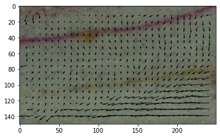
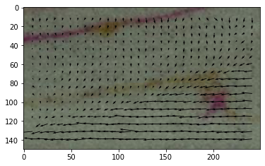
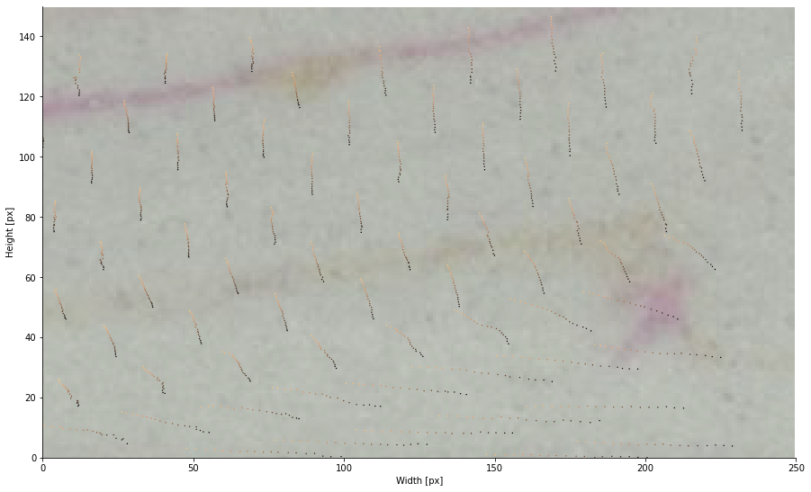

## Synthetic Particle Trajectory Velocimetry
- Uses the MATLAB Particle Image Velocimetry (PIV) toolbox [PIVLab](https://www.mathworks.com/matlabcentral/fileexchange/27659-pivlab-particle-image-velocimetry-piv-tool-with-gui).
- Use the displacements generated using PIV to displace artificially seeded particles.
- View the resulting trajectories.
- All measurements are in pixels.

# Module imports
- need to install pims


```python
import pandas as pd
import numpy as np
import matplotlib.pyplot as plt
import glob
import pims
```

# Load images and Particle Image Velocimetry data
- Examine displacement in sand
- Plot first and last frame
- Note the different zones of displacement


```python
images = pims.ImageSequence('../data/*.jpg')
pfiles = glob.glob('../data/github_test_*.txt')
pfiles.sort()
```


```python
images
```


    <Frames>
    Source: D:\Dropbox\morphagenetests\sptv_code\data\*.jpg
    Length: 20 frames
    Frame Shape: (150, 250, 3)
    Pixel Datatype: uint8


```python
data = pd.read_csv(pfiles[0], skiprows=3, usecols=[0, 1, 2, 3],
                   names=['x', 'y', 'u', 'v'])
plt.imshow(images[0])
plt.quiver(data.x,data.y,data.u,data.v)
```


    <matplotlib.quiver.Quiver at 0x200a3497f40>


    

    


```python
data = pd.read_csv(pfiles[-1], skiprows=3, usecols=[0, 1, 2, 3],
                   names=['x', 'y', 'u', 'v'])
plt.imshow(images[-1])
plt.quiver(data.x,data.y,data.u,data.v)
```


    <matplotlib.quiver.Quiver at 0x200a3597910>


    

    


# Run main.py to generate particle trajectories
- Uses the function particle_displacer to move seeded particles with displacement field for multiple images (here 20 images)
- Read results in and plot


```python
run ../src/main.py
```


```python
pts = pd.read_csv('../data/pjt_highfric_15deg_glass1cm_071619_crop_artificial_pts_temp.csv')
```


```python
pts.head()
```


<div>
<style scoped>
    .dataframe tbody tr th:only-of-type {
        vertical-align: middle;
    }

    .dataframe tbody tr th {
        vertical-align: top;
    }

    .dataframe thead th {
        text-align: right;
    }
</style>
<table border="1" class="dataframe">
  <thead>
    <tr style="text-align: right;">
      <th></th>
      <th>frame</th>
      <th>particle</th>
      <th>x</th>
      <th>y</th>
    </tr>
  </thead>
  <tbody>
    <tr>
      <th>0</th>
      <td>501.0</td>
      <td>0.0</td>
      <td>-1.678560</td>
      <td>0.168361</td>
    </tr>
    <tr>
      <th>1</th>
      <td>501.0</td>
      <td>1.0</td>
      <td>0.753549</td>
      <td>4.346883</td>
    </tr>
    <tr>
      <th>2</th>
      <td>501.0</td>
      <td>2.0</td>
      <td>0.753549</td>
      <td>8.475915</td>
    </tr>
    <tr>
      <th>3</th>
      <td>501.0</td>
      <td>3.0</td>
      <td>-0.500503</td>
      <td>12.327540</td>
    </tr>
    <tr>
      <th>4</th>
      <td>501.0</td>
      <td>4.0</td>
      <td>-0.500503</td>
      <td>16.456572</td>
    </tr>
  </tbody>
</table>
</div>


# Plot trajectories
- Plot selected particles for ease of viewing.


```python
 def tp_plot_traj(trajs,images,sample_int=1,particle_int=1,scaled=False,save=False,
                 cmap=plt.cm.copper):
    '''
    Convenience function to plot all trajs in a given dataframe
        with scaled axes.
    Optional settings for plotting every [sample_int] particle location and/or
        every [particle_int] particle, useful for extremely large datasets.
    '''
    f, ax = plt.subplots(figsize=(15,15))
    particles = np.sort(trajs['particle'].unique()[::particle_int])
    trajs = trajs[trajs.particle.isin(particles)]
    # initialize plot 
    #   place ticks outside of plot to avoid covering image
    #   remove right and upper axes to simplify plot
    #   only plot ticks on the left and bottom of plot
    ax.tick_params(axis='y', direction='out')
    ax.tick_params(axis='x', direction='out')
    ax.spines['right'].set_color('none')
    ax.spines['top'].set_color('none')
    ax.xaxis.set_ticks_position('bottom')
    ax.yaxis.set_ticks_position('left')
    # plot particle trajs leading up to current fram
    if scaled:
        x = trajs['x']/scale
        y = trajs['y']/scale
    else:
        x = trajs['x']
        y = trajs['y']
    ax.imshow(np.flipud(images[-1]),alpha=0.5)
    ax.scatter(x[::sample_int],y[::sample_int],
               c=trajs['frame'][::sample_int],marker='o',
               s=2, cmap=cmap,lw=0,
               vmin=trajs.frame.min(),vmax=trajs.frame.max())
    plt.axis('scaled')
    if scaled:
        ax.set_xlim([0,im_w/scale])
        ax.set_ylim([0,im_h/scale])
        ax.set_xlabel('Width [cm]')
        ax.set_ylabel('Height [cm]')
    else:
        ax.set_xlim([0,im_w])
        ax.set_ylim([0,im_h])     
        ax.set_xlabel('Width [px]')
        ax.set_ylabel('Height [px]')
    if save:
        plt.savefig('%s_f%05ito%05i.png'%(prefix,trajs.frame.min(),
                                          trajs.frame.max()),dpi=200,
                                          bbox_inches='tight')
        plt.close('all')
```


```python
tp_plot_traj(pts,images,particle_int=25)
```


    

    

