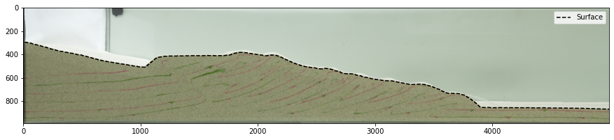
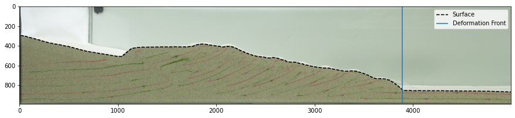

# Calculating wedge slopes
- Take output from surface_generator
- Extract the section of the wedge before the deformation front
- All measurements are in pixels

# Module imports


```python
import pims
import pandas as pd
import numpy as np
import matplotlib.pyplot as plt
from utils import *
```


```python
## pjt_slope15_prebuilt_062218, high fric baseline parameters
images = pims.ImageSequence('data/*.jpg')
xmin,xmax,ymin,ymax = 95, 5095,300, 1290 # pixel boundaries of image crop
scale=63. #pixels/cm spatial
im_w=images.frame_shape[1]
im_h=images.frame_shape[0]
surfs = 'pjt_slope15_prebuilt_062218_surfnocv_2023.h5'
```

# Examine wedge surfaces


```python
surf = pd.read_hdf(surfs,'wedgetop_00000')
plt.figure(figsize=(15,5))
plt.imshow(images[0][ymin:ymax,xmin:xmax])
plt.plot(surf.x-xmin,-surf.y+im_h-ymin,'k--')
plt.legend(['Surface'])
```


    <matplotlib.legend.Legend at 0x7f6f8e7d3d00>


    

    


# Calculate deformation front position
- Use image processing tools to identify curvature in the surface of each wedge
- Identify deformation front as the very front of deformed topography.
- This position changes throughout each experiment.


```python
def deformation_front_mode(surfs,xmin,ymax,im_h,far_edge_count=1000,
                           threshold=10,
                           from_larger=True, vergence='s'):
    '''     
    Examine calcuated surfaces, and determine the surface expression of their
        deformation fronts over the length of an experiment.
         
    Perform calcuation on surface with the retrowedge as the first area that 
        exceeds the average flat topography elevation, and the deformation 
        front defined as the last area that exceeds elevation outside of 
        a specifed range of [sand_elev +/- surfvar].
         
    Calcuated value is only the physical expression of the deformation front, 
        as actual deformation may jump forelandward for a short time 
        before surface expression.         
    '''
    surfs_keys = list(h5py.File(surfs,'r'))
    # determine maxlimum width of profile
    len_x = []
    for i, key in enumerate(surfs_keys):    
        surf = pd.read_hdf(surfs,key)
        if from_larger:
            surf.x = surf.x - xmin
            surf.y = surf.y - (im_h-ymax)
        len_x.append(surf.x.max())
    width = int(max(len_x))    
    
    # place surface in preallocated array
    surface = np.zeros((len(surfs_keys),width))
    for i, key in enumerate(surfs_keys):    
        surf = pd.read_hdf(surfs,key)
        surf = surf.y.dropna().reindex(surf.x, method='nearest').reset_index()
        if from_larger:
            surf.x = surf.x - xmin
            surf.y = surf.y - (im_h-ymax)
        surface[i,np.array(surf.x.values,dtype='int')-1] = surf.y.values
        
    # determine mean height of foreland material on far edge of surface array
    far_edge_mean = surface[:,-far_edge_count:].mean()
    # mask to find area that is within a given elevation of this mean
    mask = (surface > far_edge_mean - threshold) & \
                (surface < far_edge_mean + threshold)
    # set boolean mask on edges to remove edge effects
    mask[:,-far_edge_count:] = True
    
    # different modes for either style of model
    if vergence == 's':
        edge = nd.filters.sobel(mask.astype(float))
        front = []
        for i in range(edge.shape[0]):
            if len(edge[i,:][edge[i,:] > 0]):
                front_loc = np.nonzero(edge[i,:])[0][-1]
                front.append([i,front_loc])
            else:
                front.append([i,np.nan])
        front = pd.DataFrame(front,columns=('frame','x_df'))
    if vergence == 'd':
        mask[:,:far_edge_count] = True
        edge = nd.filters.sobel(mask.astype(float))
        front = []
        for i in range(edge.shape[0]):
            if len(edge[i,:][edge[i,:] > 0]):
                retro_loc = np.nonzero(edge[i,:])[0][0]
                front_loc = np.nonzero(edge[i,:])[0][-1]
                front.append([i,retro_loc,front_loc])
            else:
                front.append([i,np.nan,np.nan])
        front = pd.DataFrame(front,columns=('frame','x_rf','x_df'))
    elif vergence != 's' and vergence != 'd':
        raise ValueError('Choose either singly (s) or doubly (d) vergent mode') 
    return front
```


```python
front = deformation_front_mode(surfs,xmin,ymax,im_h)
front
```


<div>
<style scoped>
    .dataframe tbody tr th:only-of-type {
        vertical-align: middle;
    }

    .dataframe tbody tr th {
        vertical-align: top;
    }

    .dataframe thead th {
        text-align: right;
    }
</style>
<table border="1" class="dataframe">
  <thead>
    <tr style="text-align: right;">
      <th></th>
      <th>frame</th>
      <th>x_df</th>
    </tr>
  </thead>
  <tbody>
    <tr>
      <th>0</th>
      <td>0</td>
      <td>3795</td>
    </tr>
    <tr>
      <th>1</th>
      <td>1</td>
      <td>3795</td>
    </tr>
    <tr>
      <th>2</th>
      <td>2</td>
      <td>3795</td>
    </tr>
    <tr>
      <th>3</th>
      <td>3</td>
      <td>3792</td>
    </tr>
    <tr>
      <th>4</th>
      <td>4</td>
      <td>3789</td>
    </tr>
    <tr>
      <th>5</th>
      <td>5</td>
      <td>3786</td>
    </tr>
    <tr>
      <th>6</th>
      <td>6</td>
      <td>3783</td>
    </tr>
    <tr>
      <th>7</th>
      <td>7</td>
      <td>3780</td>
    </tr>
    <tr>
      <th>8</th>
      <td>8</td>
      <td>3782</td>
    </tr>
    <tr>
      <th>9</th>
      <td>9</td>
      <td>3782</td>
    </tr>
  </tbody>
</table>
</div>


```python
plt.figure(figsize=(15,5))
plt.imshow(images[0][ymin:ymax,xmin:xmax])
plt.plot(surf.x-xmin,-surf.y+im_h-ymin,'k--')
plt.vlines(front.iloc[0].x_df+xmin,0,ymax-ymin)
plt.ylim(ymax-ymin,0)
plt.legend(['Surface','Deformation Front'])
```


    <matplotlib.legend.Legend at 0x7f6f8b70f310>


    

    


# Fit surface of wedge
- Here we are demarcating the wedge as any material between the backstop (i.e., x=0) and the deformation front.
- The defintition of the active wedge is changable, and others may define the wedge as the material between the first interruption in topography (~1000 pixels across the image) and the deformation front.


```python
slopes = slope_deffront(surfs,front,plotting=True)
```


- Here we see that the average slope of the wedge is roughly 5.5 degrees from horizontal.
