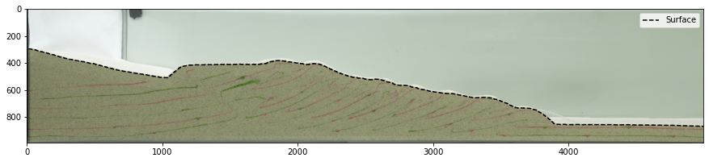
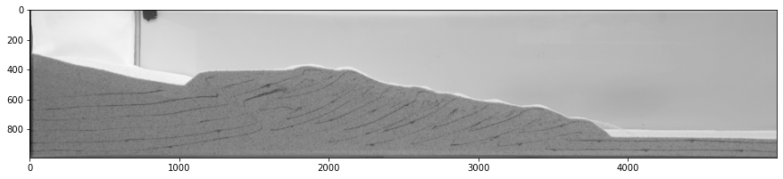
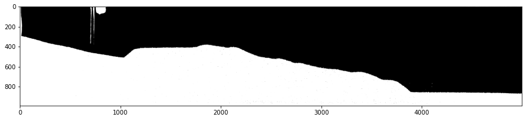
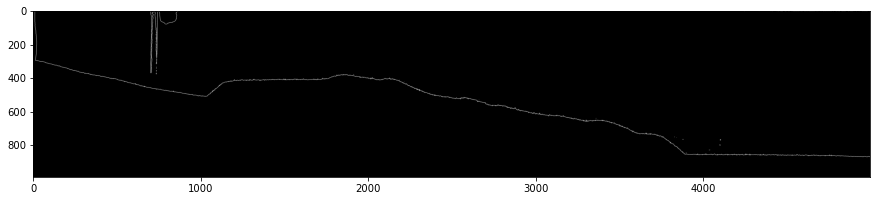

# Image Surface Tracking
- For analog tectonic models, the position of the surface is of the utmost importance
- From this surface, we can calculate quantities like particle depth, surface slope, deformation front postion, among others
- We can use image processing techniques to create simple masks which can then be used to calculate each surface.
- All measurements are in pixels.

# Module Imports 


```python
import pandas as pd
import numpy as np
import matplotlib.pyplot as plt
import pims
```


```python
images = pims.ImageSequence('data/*.jpg')
xmin,xmax,ymin,ymax = 95, 5095,300, 1290 # pixel boundaries of image crop
```

# Model Images


```python
plt.figure(figsize=(15,5))
plt.imshow(images[0][ymin:ymax,xmin:xmax,:] )
```


    <matplotlib.image.AxesImage at 0x1ef009968b0>


    

    


# Surface Tracking Function
Extract surface by:
- Converting to grayscale

- Use a bimodal image thresholding technique (such as Otsu's method (1979)) to separate foreground from background (note the small holes towards the front of the wedge)

- Using pixel labeling (Jain 1989), fill in the foreground mask to plug holes

- Use Sobel edge detection on resulting mask and identify border between foreground and background as the surface



```python
def subsel_surface_generator_nocv(images,hdf_storename,
                                  xmin,xmax,ymin,ymax,
                                  surf_cutoff = 15,
                                  from_larger=False, plate=False, 
                                  medwindow=31):
    '''
    Calculate wedge surface location for an entire wedge experiment, without 
        using OpenCV, as it can be difficult to install on some systems,
        and with all required functionality handled by skimage, scipy 
        and pandas

    Parameters
    ----------
    images : list
        List of images to analize.
    hdf_storename : str
        Hdf5 file to store surface data, with keys of format 'wedgetop_*****.
    from_larger : bool, optional
        WHether or not the surface should be taken from larger image. 
        The default is False.

    Returns
    -------
    None.

    '''
    st = pd.HDFStore(hdf_storename)
    for i,im in enumerate(images):
        # greyscale of original image
        if type(images) == pims.image_sequence.ImageSequence:
            if im.shape[-1] == 4: #RGBA
                basic_grey = color.rgb2gray(np.asarray(im)[:,:,:-1])
            else: #RGB
                basic_grey = color.rgb2gray(np.asarray(im))
        else:
            im = io.imread(im)
            if im.shape[-1] == 4: #RGBA
                basic_grey = color.rgb2gray(im[:,:,:-1])
            else: #RGB
                basic_grey = color.rgb2gray(im)
        # crop from larger image (most are)
        if from_larger:
            orig_h = basic_grey.shape[0]
            basic_grey = basic_grey[ymin:ymax,xmin:xmax]  
        
        # Otsu (1979) thresholding to get histogram threshold value
        thresh = filters.threshold_otsu(basic_grey)
        threshed = basic_grey<thresh
        
        # fill in any holes, no matter how small, via labeling (Jain, 1989)
        labels = measure.label(threshed)
        labelCount = np.bincount(labels.ravel())
        background = np.argmax(labelCount)
        threshed[labels != background] = 1
        sure_bg_filled = binary_fill_holes(threshed).astype(np.uint8)
            
        # sobel edge detection 
        edge = filters.sobel(sure_bg_filled)
        
        # extract surface from detected edge
        surf = []
        for j in range(edge.shape[1]):
            if len(edge[:,j][edge[:,j] > 0]):
                bottom = np.nonzero(edge[:,j])[0][-1]
                surf.append([j,edge.shape[0]-bottom])
        surf = pd.DataFrame(surf,columns=('x','y'))
        # delete points that are within wedge
        surf.y[surf.y.diff().abs() > surf_cutoff] = np.nan
        # adjustable median filter window to remove errant points in surface
        surf.y = medfilt(surf.y,medwindow)
        # correct coordinates to cropped version
        if from_larger:
            surf.x = surf.x + xmin
            surf.y = surf.y + (orig_h-ymax)
        # save surf, as int16 as we're dealing with pixel edges (save space)
        surf_xy = np.vstack((surf.x,surf.y)).astype(np.int16)
        st.put('wedgetop_%05.0f'%i,pd.DataFrame(surf_xy.T,columns=('x','y')))
        print(r'Calculated surface of image # %05.0f'%(i))
    st.close()
```

# Run Script


```python
run src/main.py
```

    Calculated surface of image # 00000
    Calculated surface of image # 00001
    Calculated surface of image # 00002
    Calculated surface of image # 00003
    Calculated surface of image # 00004
    Calculated surface of image # 00005
    Calculated surface of image # 00006
    Calculated surface of image # 00007
    

# Plot Surfaces
- Determine of algorithm worked correctly


```python
surf = pd.read_hdf('pjt_slope15_prebuilt_062218_surfnocv_2023.h5', 'wedgetop_00001')
```


```python
plt.figure(figsize=(15,5))
plt.imshow(images[0][ymin:ymax,xmin:xmax,:])
plt.plot(surf.x-xmin,(images.frame_shape[0])-surf.y-ymin, 'k--')
plt.legend(['Surface'])
```


    <matplotlib.legend.Legend at 0x1ef065e9f70>


    

    

